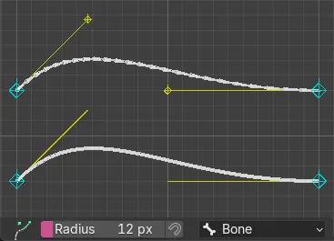

<h1 align="center">
    Sei Bbonenet
</h1>

    Construct bézier or bendy bones as a net.

    

## Installation

1. Download [sei_bbonenet.py](<./sei_bbonenet.py>).
1. In Blender, go to `Edit -> Preferences -> Add-ons -> Add-ons Settings -> Install from Disk`.
1. Locate and select the downloaded file.
1. Upon successful installation, the tool will apear in the 3D View toolbar (shortcut: **T**).

## Compatibility

This add-on is confirmed to be compatible with the following Blender versions:

- 5.2.0

> [!CAUTION]
> *Issues may arise with other versions.*

## Documentation

- **Radius**  
    Pixel radius for nearest element detection.

- **Snap**  
    Snap to the current armature.

- **Bone**  

    - **Type**  
    Defines whether to create a *Bézier* or *Bendy* bone.

    - **Segments**  
    Number of subdivisions of bone.

    - **Scale**  
    Global scale for the new bones.

    - **Merge Distance**  
    Maximum distance between bones to merge.

    - **Normal**  
    Defines whether to use *Vertex* or *Face* normals for the new bone if available.

    > [!TIP]
    > *Use Automatic Weights.*  
    > *Use Smooth Corrective for better deformation.*