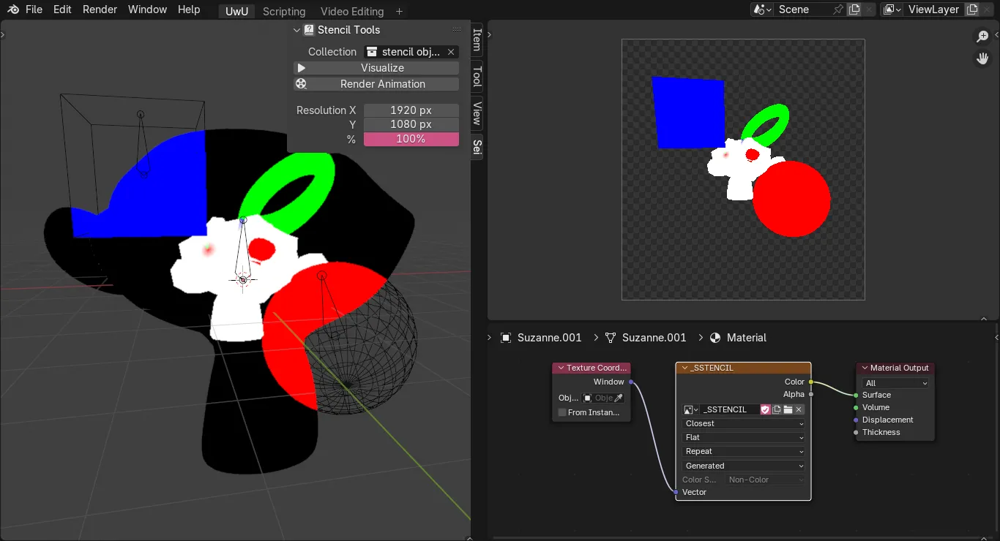

<h1 align = "center">Sei Stencil</h1>

This add-on creates a stencil pass as a Blender image.

    

## Installation

1. Download [sei_stencil.py](./sei_stencil.py).
1. In Blender, go to `Edit -> Preferences -> Add-ons -> Add-ons Settings -> Install from Disk`.
1. Locate and select the downloaded file.
1. Upon successful installation, the "Sei" category will appear in the 3D View sidebar (shortcut: **N**).

## Compatibility

This add-on is confirmed to be compatible with the following Blender versions:

- 4.4.0

> *Note: Issues may arise with other versions.*

## Documentation

- **Collection**  
    Specifies the collection used to retrieve objects for the stencil.

- **Visualizer**  
    Writes the stencil to an image named "_SSTENCIL".  
    Supported object types: *MESH*

- **Render Animation**  
    Applies the stencil during rendering.  
    Supports a single-frame render.

> *Note: Ensure the **image** space and coordinates are correctly configured. For the shader editor, use "Non-Color" and "Window Coordinates".*

- **Resolution X**  
    Defines the resolution of the scene and stencil along the x-axis.

- **Resolution Y**  
    Defines the resolution of the scene and stencil along the y-axis.

- **Resolution %**  
    Defines the resolution percentage for the scene and stencil.

> *Note: Be sure to set the correct values before rendering.*